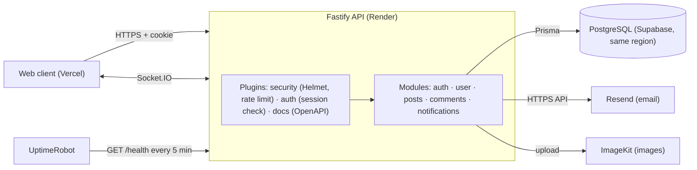

# Konekta: Social Network API

A production-style backend for a social network: authentication with email flows, a follow graph with private accounts, posts and a visibility-aware feed, comments, and realtime notifications over Socket.IO.

Built with **Fastify 5, TypeScript, Prisma and PostgreSQL**. Deployed on Render with a Supabase database, tested end to end in CI against the production Docker image.

[](https://github.com/JafMah97/konekta-social-backend/actions/workflows/ci.yml)


## Try it

| | |
|---|---|
| **Interactive API docs** | https://konekta-social-backend.onrender.com/docs |
| **Health (includes database)** | https://konekta-social-backend.onrender.com/health |
| **Demo login** | `demo@example.com` / `demo12345` |

In the docs, call `POST /auth/login` with the demo login. It sets an httpOnly session cookie, and every other endpoint then works from the same page. Account-level changes (password, email, deletion) are disabled for the demo accounts so the demo stays usable for the next visitor.

## Highlights

- **Feed queries cut from 112 to 12 per page.** Replaced per-post lookups with batched queries; with ~20 ms of database latency a page went from 1135 ms to 448 ms, and responses stayed byte-identical. [Details](ENGINEERING.md#1-feed-n1-112--12-queries-per-page)
- **Database latency from 407 ms to 15 ms** by co-locating the API and database in the same region. [Details](ENGINEERING.md#2-latency-is-geography-407-ms--15-ms)
- **Revocable sessions on top of JWT.** Logout and password changes invalidate tokens immediately, including live WebSocket connections.
- **Email flows built for security.** Hashed single-use tokens, no account enumeration (identical responses and timing), magic-link sign-in, and email changes that can't lock you out.
- **Race-safe by construction.** Follow requests and token redemption stay correct under concurrent requests, which the tests check deliberately.
- **CI runs the real artifact.** Every push builds the production Docker image, runs it against a fresh Postgres, checks for schema drift and runs an end-to-end smoke test.

The reasoning, trade-offs and before/after numbers behind each of these are in **[ENGINEERING.md](ENGINEERING.md)**.

## Features

**Authentication**
- Register, login, logout; sessions stored server-side and checked on every request
- Email verification by 6-digit code or link; resend; password reset
- Passwordless sign-in with a magic link
- Change email (pending until confirmed; the old address is notified) and change password
- Security emails for password changes, email changes and account deletion (HTML + plain text)

**Social graph**
- Follow / unfollow; private accounts with follow requests (accept / reject / cancel)
- Followers, following and follow suggestions

**Posts and feed**
- Create, update and delete posts with image upload (ImageKit)
- Feed with visibility rules: public posts, your own, and followers-only posts from accounts you follow
- Likes, bookmarks and saved posts

**Comments**
- Comment, edit, delete, and like comments

**Realtime notifications**
- Likes, comments, follows and follow requests are stored and pushed live over Socket.IO
- Unread counts, mark read, mark all read, delete; no self-notifications, deduplicated likes

**Security and operations**
- Rate limiting (strict per-route limits on auth endpoints), security headers, CORS allow-list
- Authenticated Socket.IO handshake with room-based delivery (multi-tab safe)
- OpenAPI 3.1 docs generated from the same Zod schemas the handlers validate with
- Liveness (`/ping`) and readiness (`/health`) endpoints

## Architecture



Each module keeps one file per endpoint, with Zod schemas and an error handler alongside. Cross-cutting concerns live in Fastify plugins; shared logic (sessions, tokens, email, notifications) lives in small utility modules.

```text
src/
  bootstrap/      app assembly (plugin order matters), logger
  plugins/        prisma, authenticate, security, websocket, docs, errorHandler
  modules/
    auth/         register, login, verification, reset, magic link
    user/         profile, settings, follow system, email/password changes
    post/         posts, feed, likes, bookmarks
    comment/      comments and comment likes
    notification/ notify() service + endpoints
  docs/           route documentation map (drives the OpenAPI spec)
  scripts/        demo data seed
  utils/          sessions, tokens, mailer, uploads, account deletion
prisma/           schema and migrations
scripts/          smoke.mjs (end-to-end check against any deployment)
```

## Tech stack

| Choice | Why |
|---|---|
| **Fastify 5** | Fast, with a plugin system that keeps concerns (auth, security, docs) encapsulated and ordered |
| **TypeScript** | Types end to end, from Prisma models to request handlers |
| **Prisma + PostgreSQL** | Typed queries, versioned migrations, and a relational model that fits a social graph |
| **Zod** | One schema per endpoint for validation, reused to generate the OpenAPI docs |
| **Socket.IO** | Realtime delivery with rooms per user and per session, so revoking a session also closes its sockets |
| **JWT + session table** | Stateless signature checks, plus a revocable session row for real logout |
| **Resend** | Email over HTTPS (the free hosting tier blocks SMTP ports) |
| **Docker + GitHub Actions** | The same image runs locally, in CI and in production |

## Getting started

**With Docker** (Postgres, migrations and API):

```bash
docker compose up --build
docker compose run --rm migrate npm run seed:demo -- --yes   # demo data
open http://localhost:4000/docs                                # login: demo@example.com / demo12345
```

**Without Docker** (Node 24 and a PostgreSQL database):

```bash
npm ci
cp .env.example .env                  # set DATABASE_URL, DIRECT_URL, JWT_SECRET, COOKIE_SECRET
npx prisma migrate deploy
npm run seed:demo -- --yes
npm run dev
```

Without a `RESEND_API_KEY`, emails are printed to the console in development, so verification and reset links can be clicked locally.

| Script | What it does |
|---|---|
| `npm run dev` | Start with hot reload |
| `npm run build` / `npm start` | Production build and start |
| `npm run seed:demo` | Dry run; add `-- --yes` to load demo data, `-- --reset --yes` to remove it |
| `node scripts/smoke.mjs` | End-to-end check against `BASE_URL` (default `http://localhost:4000`) |

## API overview

Full, interactive reference: **[/docs](https://konekta-social-backend.onrender.com/docs)** (OpenAPI 3.1, spec at `/docs/json`).

| Area | Endpoints |
|---|---|
| Auth | `POST /auth/register` `login` `logout` `verify-email-with-code` `verify-email-with-link` `resend-verification` `forgot-password` `reset-password` `magic-link` `magic-link/verify` |
| Users | `GET /user/me` `GET /user/:userId` `PUT /user/profile-update` `POST /user/profile-picture` `POST /user/change-email` `POST /user/change-password` `DELETE /user/delete-account` … |
| Follows | `POST /user/follow/:userId` `DELETE /user/follow/:userId` `GET /user/follow-requests` `POST /user/follow-requests/:id/accept` `…/reject` `GET /user/followers/:userId` `GET /user/following/:userId` `GET /user/suggestions` |
| Posts | `GET /posts/list` `GET /posts/get/:postId` `POST /posts/create` `PUT /posts/update/:postId` `DELETE /posts/delete/:postId` `POST /posts/like/:postId` `POST /posts/save/:postId` `GET /posts/saved` … |
| Comments | `GET /comments/post/:postId` `POST /comments/create` `PUT /comments/edit/…` `DELETE /comments/delete/:commentId` `POST /comments/like` … |
| Notifications | `GET /notifications` `GET /notifications/unread-count` `POST /notifications/:id/read` `POST /notifications/read-all` `DELETE /notifications/:id` |

Errors always use one shape: `{ "success": false, "error": { "code", "message", "details"? } }`.

## Testing and CI

Every push to `main` runs [two jobs](.github/workflows/ci.yml):

1. **Checks:** Prisma schema validation, ESLint, TypeScript, build.
2. **End to end:** fresh PostgreSQL → apply migrations → **schema drift check** → seed demo data → **build and run the production Docker image** → `scripts/smoke.mjs` (health, docs, login, feed, notifications, logout revocation).

Larger scenarios (follow-request races, token single-use, email enumeration, realtime delivery) were verified against throwaway databases during development. They're summarized in [ENGINEERING.md](ENGINEERING.md), and turning them into an automated test suite is next on the roadmap.

## Deployment

- **API:** Render (Node runtime). The build runs `prisma migrate deploy`, and Render's health check uses `/ping`.
- **Database:** Supabase PostgreSQL in the **same region** as the API, through the transaction pooler.
- **Uptime:** UptimeRobot checks `/health` every 5 minutes, which also keeps the free-tier database active.

## Roadmap

- [ ] Automated test suite (Vitest) from the scenarios in ENGINEERING.md
- [ ] Cursor-based pagination for the feed
- [ ] Direct messages and stories (schema already modeled)
- [ ] Smaller Docker image; Prettier check in CI

## License

MIT. Made by [JafMah97](https://github.com/JafMah97).
